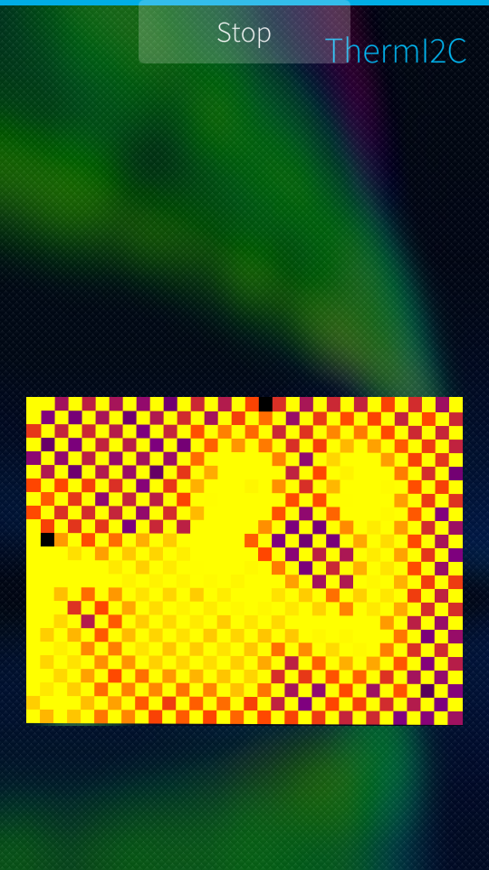
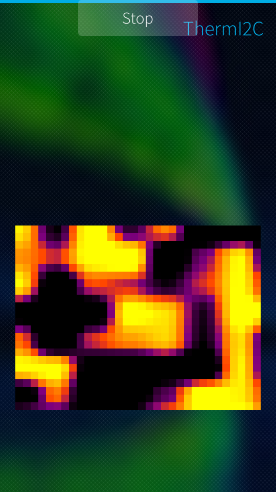
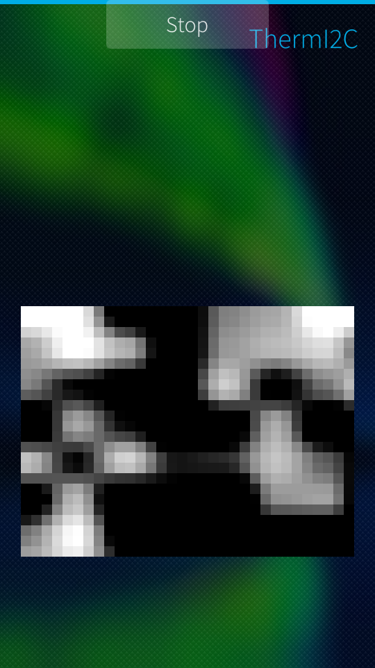
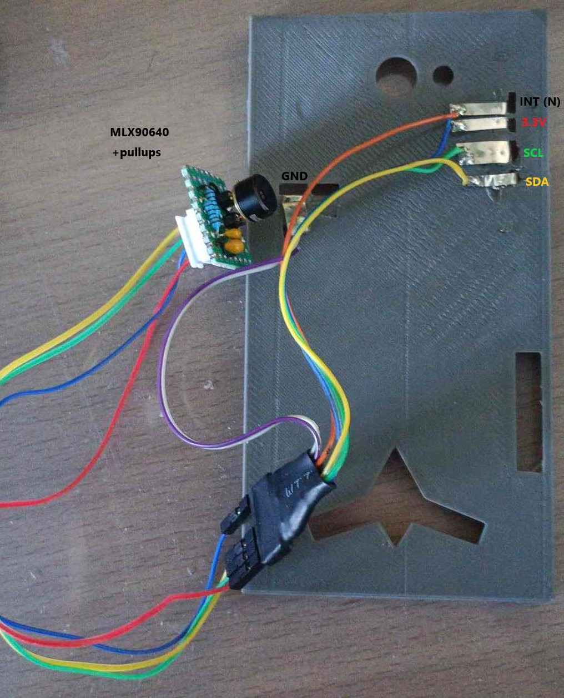

# thermi2C - a thermal camera app for the jolla 1 phone

This is an app used to interface a cheap melexis MLX90640 thermal camera (~35€ for the sensor) with a Jolla 1 phone, using the phone's built-in I2C bus.

Note that the app is closer to a tech demo than a full thermal camera driver app, it can't do temperature readings just yet, or pictures, all you get is a direct view of the thermal sensor at ~11fps (due to I2C bus speed limitations on this phone). But at least you get quite a few themes for color :\)

## screenshots

### regular mode

Sometimes the checkerboard pattern that is created due to interlacing doesn't go away, this is me waving at the camera:   


### demo mode
The app also has a demo mode for when the sensor fails/ isn't connected, it'll display perlin noise on the UI where the thermal view should be.
theme hotiron            |  theme gray
:-------------------------:|:-------------------------:
  |  

**note:** __leaving the noise generation on can cause issues with the normal mode of operation (flashing), so this line needs to be commented for the demo mode to be available:__

```c++
#include <stdint.h>

#define IGNORE_I2C_DISCONNECTS  //comment out this line to enable noise generation / demo mode

class MLX90640 : public QObject
```
Found in `mlx90640_API.h` line 92

## credits

This app uses code from these other repos:   
https://github.com/kimmoli/i2ctool   
(used for some of the I2C code, but largely reworked to maximize byte capacity and speed)   
https://github.com/melexis/mlx90640-library   
(used for most of the thermal sensor logic, also modified and objectified [C -> C++])

## hardware
You'll need a jolla 1 phone (2014)   
The 5V and INT pins on the phone are unused, here's the wiring:   

   
(N means unused here, i didn't bother to mark the 5V pin). I used some nickel strips to contact witht he pogo pins, this works quite well, a soldering iron can be used to melt the pins into their proper position.    
Some parts of the case are open, if you don't like this you can edit the fusion 360 project i dropped in ./stl/ and make your own.   

i usually get my sensors from there (MLX90640ESF-BAA):   
https://fr.aliexpress.com/item/1005004645739586.html

## Compiling the app

As for the SDK setup, you'll need the sailfish SDK (latest), **and this is important**: ***with*** version 3.4.0 OS target, which is the latest one the jolla 1 phone supports (or you can use your phone's current version if you don't want to update to 3.4).

 the sdk here: https://docs.sailfishos.org/Tools/Sailfish_SDK/

 for debugging i highly recommend this, to at least check that the camera IS connected and responding:
 https://github.com/kimmoli/i2ctool   
 Probe with it, address 33 should light up green. If it doesn't either you wired it wrong or your camera's dead.   
 this app can also be installed directly from the jolla store, easier to get working imo.   

 Happy hacking!